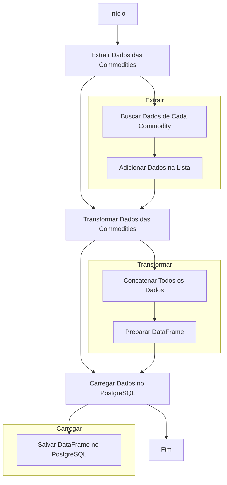

# Projeto DBT-Core para Data Warehouse

Este projeto utiliza DBT (Data Build Tool) para gerenciar e transformar dados de um Data Warehouse (DW) de commodities. O objetivo é criar um pipeline de dados robusto e eficiente que trata e organiza os dados de commodities e suas movimentações para análise.

## Estrutura do Projeto

